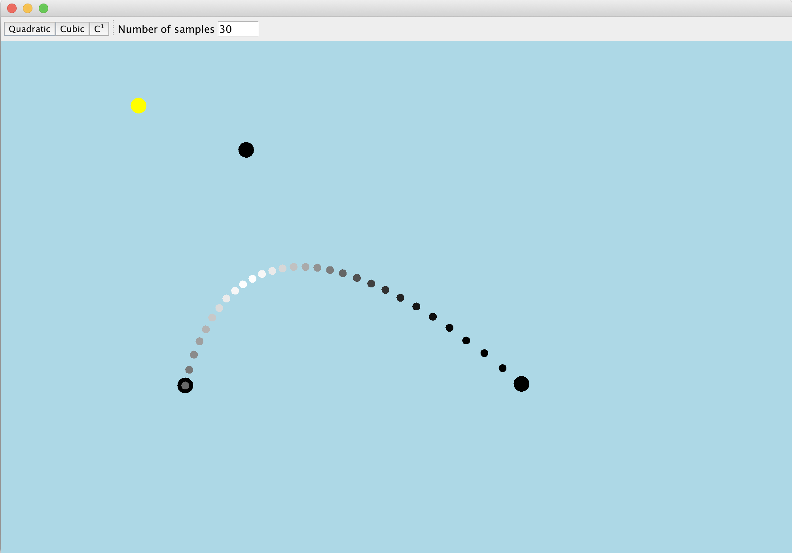
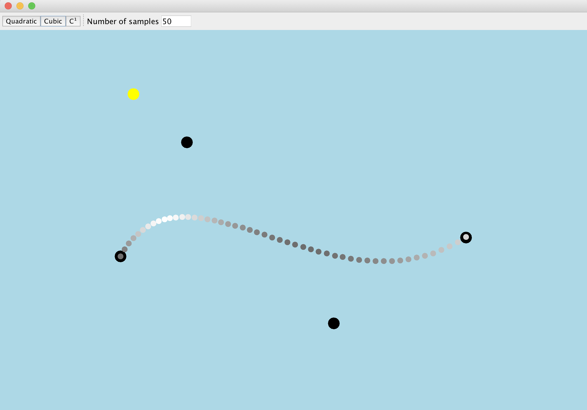
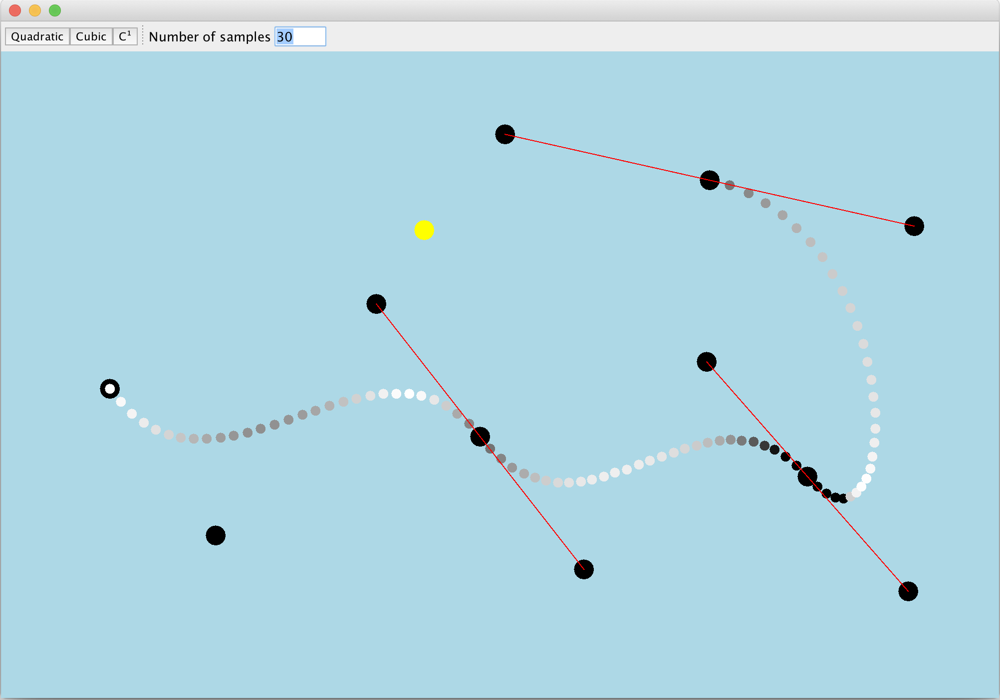

# Composite Bézier Curve

The application implements various versions of [Bézier curves](https://en.wikipedia.org/wiki/B%C3%A9zier_curve). 

Quadratic Bézier Curve
------


Cubic Bézier Curve
------


Composite Bézier Curve
------


## Getting Started

These instructions will get you a copy of the project up and running on your local machine for development and testing purposes.

### Prerequisites

* Java 1.8
* Maven 10.13.3+

### Installing

```
mvn clean package
```

## Running the tests

```
mvn test
```

## License

This project is licensed under the MIT License - see the [LICENSE](LICENSE) file for details
